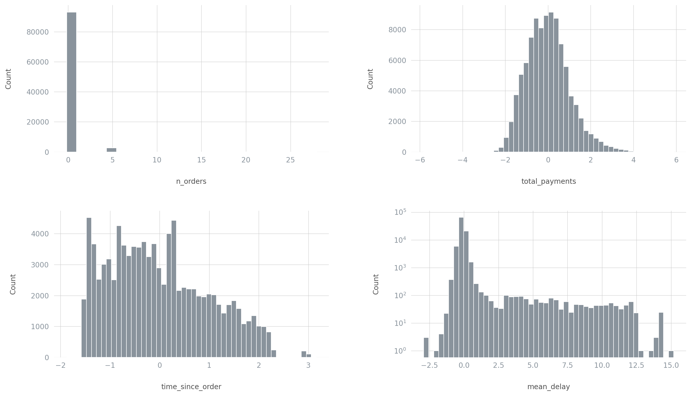
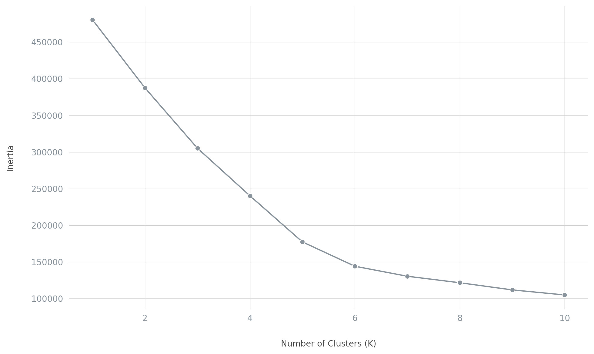
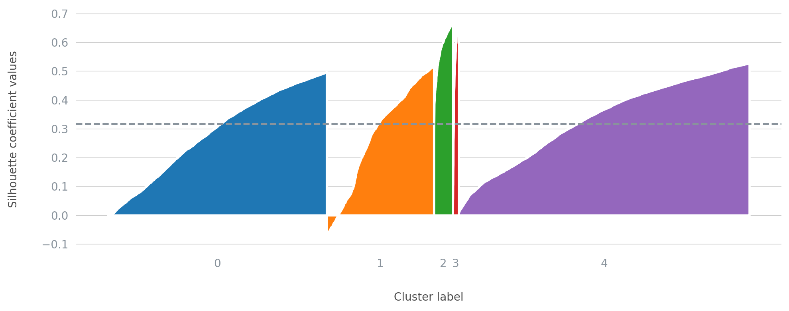
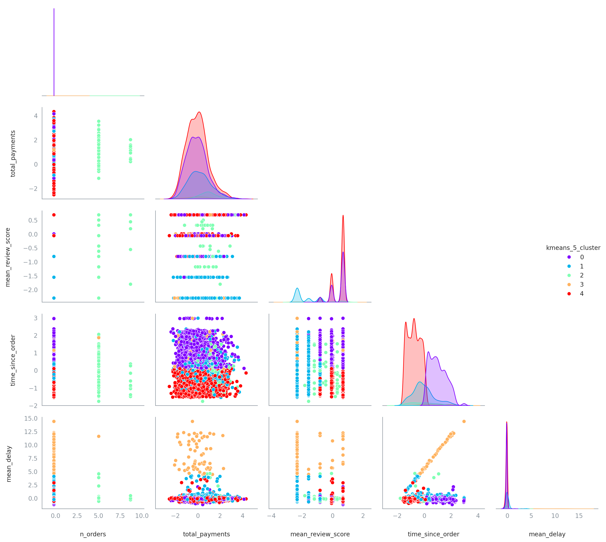
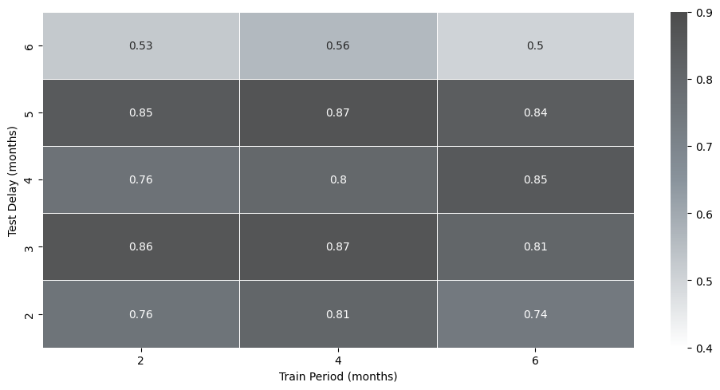

# Customer Segmentation

## Project Overview

This project aims to segment customers based on their transactional data using K-Means clustering technique. The goal is to identify distinct customer groups with similar characteristics, preferences, and behaviors, to enable targeted marketing, improve customer satisfaction, and drive business growth.

## Business Impact

By understanding our customer segments, we can:

* Increase revenue through targeted marketing and personalized experiences
* Improve customer satisfaction and loyalty through tailored offerings and services
* Enhance operational efficiency by optimizing resource allocation and supply chain management
* Gain a competitive edge by identifying and capitalizing on emerging trends and opportunities

## Database Exploration

The database is structured as follows:

A series of SQL queries are made to explore the database and get an overview of the sellers performance and client reviews:
1.  Orders with at least 3 days of delay in delivery within the last 90 days, excluding canceled orders
2.  Sellers with total income higher than 100,000 reais
3.  New sellers (<3 months on the platform) with at least 30 orders
4.  Bottom 5 post codes with the lowest average review score, with at least 30 orders in the last year

## Clustering

### Data Description

CSV files including orders, customers, payments and review data are joined to create a dataset of 104 478 records with 8 features.

* **order features**:
  * order_id
  * order_status
  * order_purchase_timestamp
  * order_delivered_customer_date
  * order_estimated_delivery_date
  * payment_value
* **customer features**:
  * review_score
  * customer_unique_id

### Data Preprocessing

 The preprocessing steps include:
1. **Imputing** missing review scores with mean value
2. **Converting** dates and times into integers
3. **Log transforming** number of orders and total payments
4. **Standardizing** all numerical data

### K-Means Clustering

#### Number Of Clusters

The elbow plot is a technique for determining the optimal number of clusters (k) in the k-means algorithm. It involves running the k-means algorithm for different values of k and plotting the sum of squared errors (SSE) or inertia against the number of clusters. The SSE measures the compactness of the clustering, calculated as the sum of squared distances between each data point and its assigned cluster centroid.

As the number of clusters increases, the SSE decreases since data points are more tightly grouped within clusters. However, at some point, adding more clusters does not significantly reduce the SSE, and the plot forms an "elbow" shape. The optimal number of clusters is typically chosen at or near this elbow point, where increasing k further would not substantially improve the clustering quality while potentially leading to overfitting. The elbow plot provides a visual aid to balance the trade-off between minimizing SSE and avoiding an excessive number of clusters.

The elbow appears to be a **k = 5**. Therefore it is the number of clusters chosen for the following study. 

#### Silhouette Plot

The silhouette plot is a visualization tool that graphically displays how well each data point fits into its assigned cluster compared to other clusters. It consists of one or more silhouette bars, with each bar representing a cluster.The average silhouette coefficient across all data provides an overall clustering quality assessment. Silhouette plots are valuable for visually interpreting and validating clustering results and identifying misclustered points.

## Cluster Interpretation

A pair plot is a useful visualization tool for interpreting and validating clustering results across all feature pairs. By color-coding data points based on their assigned cluster labels, the pair plot displays scatter plots for every feature combination. Well-separated, distinct clusters across multiple scatter plots indicate successful clustering, while overlapping or poorly separated clusters may suggest issues with the clustering model or data.

The pair plot helps identify features contributing most to cluster separation, detect potential outliers or misclustered points, and gain insights into cluster characteristics across different feature combinations. This comprehensive view facilitates interpreting the clusters based on the features offering the maximum separation.

| Cluster | Description |
| --- | --- |
| **0 - Former Satisfied Customers** | - Customers whose last order is not recent - Positive mean review score - No delayed order |
| **1 - Dissatisfied with Delays** | - Negative review scores - Short delays |
| **2 - Frequent Buyers** | - Customers with multiple orders |
| **3 - High-Risk Customers** | - Customers with lost orders and/or long delays - Negative mean review score |
| **4 - New Satisfied Customers** | - Recent customers - Positive mean review score - No delayed order |

## Insights and Recommendations

* **Former Satisfied Customers**

  * Implement a win-back campaign to re-engage these customers and encourage them to make new purchases.
  * Offer personalized promotions or discounts based on their previous order history and preferences.
  * Analyze the reasons behind their inactivity (e.g., product dissatisfaction, competitor offerings) and address any issues.

* **Dissatisfied with Delays**

  * Improve order fulfillment and logistics processes to minimize delays.
  * Offer compensation or incentives for customers affected by delays.
  * Enhance communication and provide real-time order tracking to manage expectations.

* **Frequent Buyers**

  * Develop a loyalty program to reward and retain these valuable customers.
  * Offer exclusive deals, early access to new products, or personalized recommendations based on their purchase history.
  * Analyze their buying patterns and preferences to optimize product offerings and marketing strategies.

* **High-Risk Customers**

  * Implement stricter fraud detection and order verification processes for this high-risk segment.
  * Improve customer service and order tracking to minimize lost orders and delays.
  * Consider offering alternative payment or delivery options to mitigate risks.

* **New Satisfied Customers**

  * Focus on providing an exceptional onboarding experience for these new customers.
  * Encourage them to leave reviews and share their positive experiences to attract more new customers.
  * Cross-sell and upsell complementary products based on their initial purchases.

## Data Drift Analysis

### Methodology

To simulate data drift and determine the optimal set size and retraining frequency for the model, the data is split into a train set (before a date *D*) and a test set (after *D*). The model is trained on the train set and evaluated on the test set using the **Adjusted Rand Index (ARI)**.

This process is repeated by varying the size of the train set (e.g., 2 months, 4 months) and the window of test data (e.g., 1 month after *D*, 3 months after *D*). By analyzing the ARI across different train set sizes and test data windows, businesses can identify the optimal combination that maximizes model accuracy and stability over time

### Adjusted Rand Index

The Adjusted Rand Index compares the results obtained from the model with the expected customer clusters. It adjusts for the chance of random cluster assignments, providing a score between 0 and 1, where 1 indicates a perfect match between the predicted and true clusters. A higher ARI value signifies better agreement and less data drift between the model's segmentation and the actual customer segments, making it a useful tool for assessing the performance and stability of customer segmentation models over time.
To assess the stability of the customer segments and the need for model retraining, a data drift analysis was conducted. The analysis revealed:

According to the heatmap visualizing the Adjusted Rand Index (ARI) values, the best training period to obtain the most accurate and stable customer clusters over time is **4 months**.  The heatmap also shows that retraining the customer segmentation model every **3 or 5 months** yields the highest ARI scores, indicating the best results in terms of cluster stability and accuracy compared to the true customer segments.

### Business Impact of Data Drift Analysis

By regularly retraining the customer segmentation model and adapting to changes in customer behavior, businesses can:

* Maintain accurate customer segmentation and targeted marketing efforts
* Identify emerging trends and opportunities to stay ahead of the competition
* Optimize resource allocation and supply chain management to meet changing customer needs
* Improve customer satisfaction and loyalty through timely and relevant offerings and services
